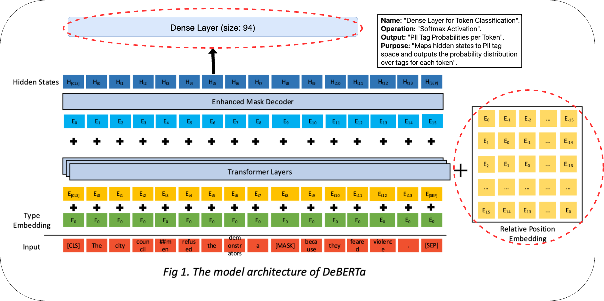
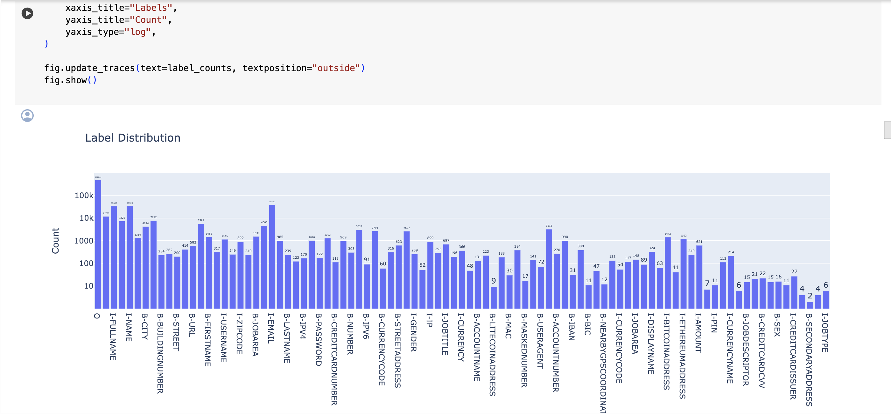
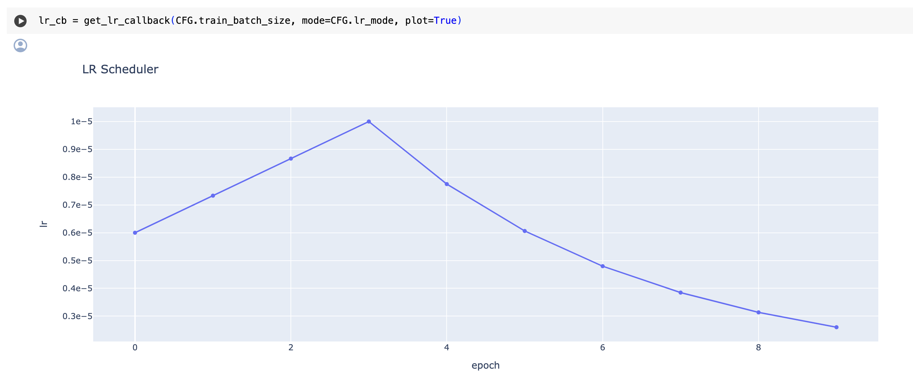
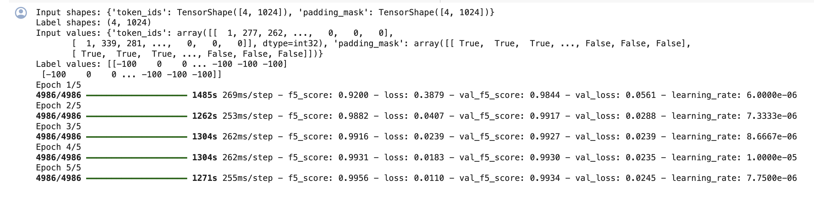

# Assessing and Masking of Personally Identifiable Information (PII)

Complexity of PII: PII encompasses a wide range of information that can directly or indirectly identify an individual. It's not just about names and social security numbers; it includes any data that can be linked to a person, such as medical records, financial information, and online identifiers.

Limitations of Traditional Methods: Many current PII detection systems are rule-based and limited to a predefined set of tags. They struggle to adapt to the evolving nature of PII and often fail to recognize context-dependent PII tags.

Objective: Our goal is to develop a deep learning-based NER model that can accurately detect 94 different PII tags, significantly expanding the detection capabilities beyond the standard 10-15 tags used in most systems.

## API Reference

### GPT-2

Documentation: 
[GPT-2 Documentation](https://github.com/openai/gpt-2)

API: 
[GPT-2 API](https://platform.openai.com/docs/models/gpt-2)

### DeBERTaV3

Documentation: [DeBERTa Documentation](https://github.com/microsoft/DeBERTa)

API: [DeBERTaV3 API](https://huggingface.co/microsoft/deberta-v3-base)

## Appendix

### Deep Learning Approach
We employ a Named Entity Recognition (NER) model with a DebertaV3 backbone. This model is capable of understanding the context of the text and identifying a wide range of PII entities.

### Comprehensive Data Processing
Our data processing pipeline includes tokenization, handling of special tokens (such as padding and start/end tokens), and alignment of labels with tokenized input. This ensures that the model receives well-structured input data.

### Adaptive Learning Rate Schedule
We use a dynamic learning rate schedule to optimize the training process. This helps the model converge faster and achieve better performance.

### Model Architecture
1. The DebertaV3 model serves as the feature extractor, capturing the contextual relationships between words in the text.
2. A dense layer is added on top of the DebertaV3 backbone to perform classification at the token level. This allows the model to assign a PII tag to each token in the input sequence.
3. The output of the dense layer is passed through a softmax activation function. This converts the logits into probabilities for each PII tag, facilitating the classification process.

### Training and Evaluation
1. A cross-entropy loss function is used, with modifications to ignore special tokens. This ensures that the loss calculation focuses on the meaningful parts of the input.
2. The F-beta score, with a focus on recall (beta=5), is used as the primary metric for evaluating the model's performance. This metric balances precision and recall, with an emphasis on reducing false negatives in PII detection

### Final Presentation
For a comprehensive overview of the project, you can check out our final presentation [here](https://docs.google.com/presentation/d/1HhorN4YtLje3-nN4yfO1XDlBp_ajjqxw/edit?usp=drive_link&ouid=105021192907539123189&rtpof=true&sd=true).

## Documentation

[Documentation](https://linktodocumentation)

## Installation

Download the files and then run the .ipynb file

    
## Screenshots

## Examples

## Feedback

If you have any feedback, please reach out to me at bhuvansh@usc.edu and bhuvanshah288@gmail.com

